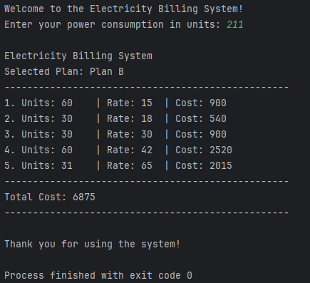
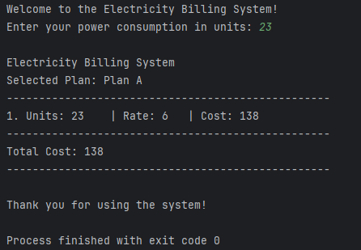

## Getting Started




### Prerequisites

- Python 3.12 or higher

### Installation

1. Clone the repository:
    ```sh
    git clone <repository-url>
    cd electric_tarrifs
    ```

2. Create a virtual environment:
    ```sh
    python -m venv venv
    ```

3. Activate the virtual environment:
    - On Windows:
        ```sh
        venv\Scripts\activate
        ```
    - On macOS/Linux:
        ```sh
        source venv/bin/activate
        ```

4. Install the required packages:
    ```sh
    pip install -r requirements.txt
    ```

### Running the Program

To run the electricity billing system, execute the following command:
```sh
python __main__.py